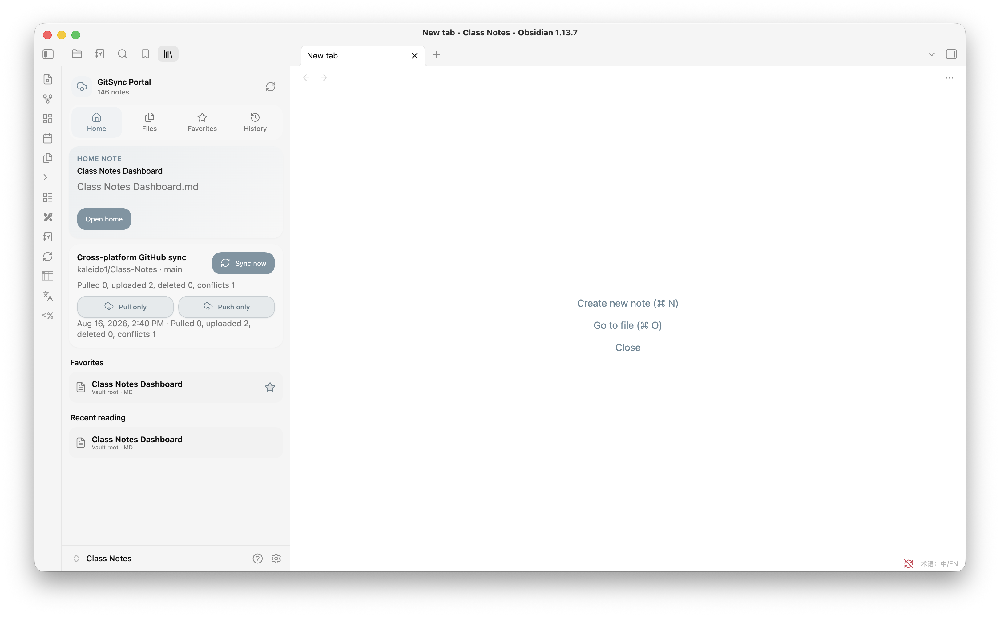

# GitSync Portal

GitSync Portal is a native Obsidian plugin that syncs your vault through GitHub — no system Git, Node.js, or shell commands required — and pairs it with a multilingual dashboard for search, favorites, reading history, and interactive quizzes.

Works the same way on **Android, iOS, Windows, macOS, and Linux**.

> GitSync Portal is an independent community project. It is not affiliated with or endorsed by Obsidian.

<p align="center">
  
</p>

## Quick start

1. Install GitSync Portal (see [Installation](#installation) below).
2. Create a GitHub [fine-grained personal access token](https://github.com/settings/tokens?type=beta) scoped to one repository, with **Contents: Read and write** permission.
3. Open **Settings → GitSync Portal**, and enter the token, the repository as `owner/repository`, and a branch.
4. Click **Test connection**, then run a manual sync and confirm the result.
5. Once you're happy with it, turn on startup, save-triggered, or periodic sync.

## Highlights

**Sync**
- Two-way GitHub sync using Obsidian's HTTP APIs — works identically on mobile and desktop
- Three-way reconciliation against the last synced commit, with two-way, pull-only, and push-only modes
- Newer-version-wins conflict resolution; the older copy is kept as a `.conflict-…` file, never lost
- Mass-deletion safeguard, conflict-copy loop prevention, and automatic retries when the remote branch moves mid-sync
- One sync queue shared by manual, startup, save-triggered, and periodic triggers — requests wait their turn instead of racing
- GitHub token stored in Obsidian's `SecretStorage`, never written to `data.json` or the vault

**Dashboard**
- Home, Files, Favorites, and History tabs with folder navigation, breadcrumbs, and back/forward
- Filename and full note-body search with IME-safe input
- Current-note heading outline, favorite/home-note shortcuts, and selected-file highlighting
- Scroll position and sync progress preserved across dashboard refreshes

**Quizzes**
- Seven Quizzable question types (multiple choice, true/false, multiple select, short text, numeric, matching, reorder)
- Saved per-device progress, per-question retry, and answer explanations

**Reading & language**
- Adjustable font size, line height, content width, paragraph spacing, and a focus mode
- Follows Obsidian's language setting automatically, or pick one explicitly — see [Languages](#languages)

## Installation

### Community Plugins (recommended)

1. Open **Settings → Community plugins** and turn on community plugins.
2. Select **Browse**, search for **GitSync Portal**, then **Install** and **Enable**.
3. Open **Settings → GitSync Portal** and follow the [Quick start](#quick-start) above.

### Manual install

Download `main.js`, `manifest.json`, and `styles.css` from the [latest release](https://github.com/kaleido1/GitSync-Portal/releases/latest) into:

```text
<Vault>/.obsidian/plugins/gitsync-portal/
```

Reload Obsidian and enable **GitSync Portal** under **Settings → Community plugins**. Don't nest the files in a subfolder or install from a ZIP.

Platform-specific steps (showing hidden folders on Windows/macOS/Android, iOS caveats) and upgrading from the plugin's earlier names (`gitsync-port`, `obsidian-viewer`) are covered in [INSTALL.md](INSTALL.md).

## Languages

GitSync Portal can follow Obsidian's language setting (**System default**) or use a language you pick explicitly, under **Settings → GitSync Portal → Language**. The dashboard updates immediately; reload Obsidian to also refresh Command Palette entry names.

| Coverage | Languages |
|---|---|
| Full interface | English, Simplified Chinese |
| Broad coverage (dashboard, settings, sync, quizzes) | Traditional Chinese, Japanese, Korean, Spanish, German, Italian |
| Navigation and core sync controls | French, Arabic, Bengali, Dutch, Polish, Portuguese, Portuguese (Brazil), Romanian, Russian, Swedish, Turkish, Ukrainian, Vietnamese |

Any text not yet translated for a language falls back to English automatically.

## How GitHub sync works

**First sync.** Files that exist on only one side are copied to the other — nothing is deleted on a first sync. A brand-new, empty GitHub repository is fine: the first two-way sync creates its initial commit from the local vault. Restoring a vault from scratch onto an existing repository should use **Pull only**.

**Conflicts.** If the same path changed on both sides, GitSync Portal compares the local modification time against the latest remote commit for that path. The newer version wins and becomes the main file; the older version is kept as a device- and timestamp-labeled `.conflict-…` copy, which is excluded from future syncs so it can't loop back in as a conflict itself.

**Two-way vs. one-directional.** The dashboard's primary action is two-way sync, with **Pull only** and **Push only** as secondary actions:
- *Pull only* applies remote changes locally without uploading; displaced local content becomes a conflict copy.
- *Push only* uploads local changes without applying remote changes; displaced remote content becomes a conflict copy. It also always publishes locally installed community plugin files that differ from the remote copy, so a plugin installed or updated on desktop reaches mobile on its next pull.

**`.gitignore`.** GitSync Portal reads the vault's root `.gitignore` on every connection test and sync.
- With **Use .gitignore** on, the **Ignored paths** editor shows and edits that file, and it syncs like any other file.
- With it off, `.gitignore` stays device-local, and **Ignored paths** becomes a separate, device-local ignore list.
- **Apply .gitignore when pulling** (off by default) additionally hides matching remote paths from pull and conflict reconciliation — so a local-only `.gitignore` doesn't silently block incoming changes unless you opt in.

**Retries.** If the remote branch changes while GitSync Portal is committing, it waits briefly, re-reads the branch head, and retries. If the change touched the same path being pushed, it re-reconciles instead of forcing the push.

**Queueing.** Manual, startup, save-triggered, and periodic sync requests share one queue: a request that arrives mid-sync waits for the current one to finish rather than racing it. With **Sync on save** enabled, favorite/history changes restart a trailing 30-second timer, so a burst of edits triggers only one sync.

## What gets synced

Included by default:
- Markdown notes and attachments
- `.gitignore`
- Obsidian themes and CSS snippets
- Community plugin files, settings, and enablement lists
- GitSync Portal's own program files
- Shared favorites and reading history (`sync-state.json`)

Device-local by default:
- Workspace layout files
- GitSync Portal's local sync baseline and generated conflict copies
- Obsidian Git runtime scripts
- Legacy `gitsync-port`/`obsidian-viewer` migration directories

Always excluded: the vault's `.git/` database and `.trash/` directory. The GitHub token lives in Obsidian `SecretStorage`, not in the vault, so it is never uploaded.

> If [Obsidian Git](https://github.com/denolehov/obsidian-git) is installed in the same vault, enable automatic sync in only one of the two plugins — two engines pushing to the same branch can race each other.

## Development

Requires Node.js 18+.

```bash
npm install
npm test
```

`npm test` runs lint, a TypeScript production build, release-metadata validation, and the sync/settings/i18n test suites.

```bash
npm run dev   # watch mode
```

Project layout:

```text
main.ts                 Plugin entry point, settings, migration, lifecycle
src/github-sync.ts       Cross-platform GitHub synchronization engine
src/viewer-view.ts       Dashboard and file navigation
src/settings.ts          Plugin settings tab
src/quiz.ts              Quizzable parsing, rendering, and scoring
src/i18n.ts              Language registry, translations, locale resolution
styles.css                Desktop and mobile styles
scripts/                  Build/release checks and test scripts
```

## Privacy and security

- Reading, search, favorites, history, and quizzes all work locally — no network access.
- GitHub is contacted only once sync is configured and triggered.
- The GitHub token is never written to `data.json`, logs, release archives, or the vault.
- Files over the configured size limit stop the sync with an error instead of being silently skipped.
- Conflict copies preserve displaced content and are excluded from future sync passes by default.

## Project history

This repository originated from `MorganTian886/Obsidian_Viewer`; the Git history retains the original authorship. The cross-platform rewrite and all releases since are independently maintained by [Kai Liu](https://github.com/kaleido1).

## License

[MIT](LICENSE)
